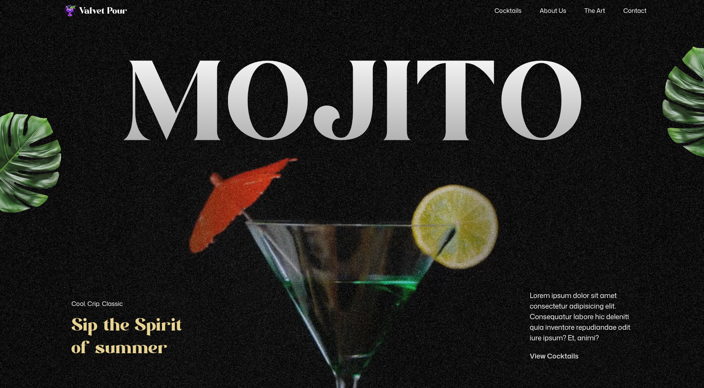

# 🥂 Valvet Pour - Cocktail Experience Website

An elegant, scroll-animated cocktail bar website built with modern frontend tools — blending smooth GSAP animations, responsive Tailwind UI, and fast-loading performance.



---

## 🚀 Tech Stack


---

## 📸 Demo Link (Click and view live)

👉 [Live Demo](https://mojito-drink.vercel.app/)

---


## ✨ Features

- 🔠 **SplitText Animations**  
  Create impactful text reveals using GSAP’s SplitText for dynamic intros and section highlights.

- 📜 **ScrollTrigger Effects**  
  Power scroll-based animations and timeline control with GSAP’s ScrollTrigger.

- 🌄 **Parallax Scrolling**  
  Add immersive depth with smooth parallax effects that respond to user scroll.

- 📌 **Pinned Sections**  
  Lock sections in view while animating content for engaging scroll experiences.

- 🎞️ **Scroll-Synced Video Playback**  
  Sync video progress with scroll position for cinematic storytelling.

- 🖼️ **Image Masking Effects**  
  Use scroll-triggered pins and masks for visually striking image transitions.

- 🖱️ **Custom Carousel**  
  Build a fully customized carousel with multiple navigation options and animated slides.

- 🧵 **Seamless Timeline Animations**  
  Craft smooth animation timelines that span across multiple sections.

- 📱 **Responsive Design**  
  Ensure fluid UI and adaptive GSAP animations across all screen sizes.

- 🛡️ **Performance & Security Optimizations**  
  Enhanced video delivery, efficient scroll handling, and secure frontend logic.
  
----------

## 🛠️ Installation

```bash
# 1. Clone the repo
git clone https://github.com/your-username/valvet-pour.git

# 2. Install dependencies
cd valvet-pour
npm install

# 3. Run locally
npm run dev
